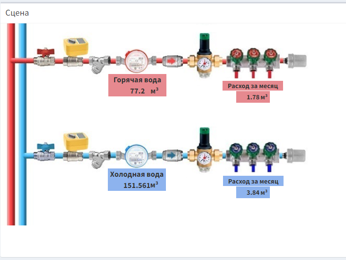
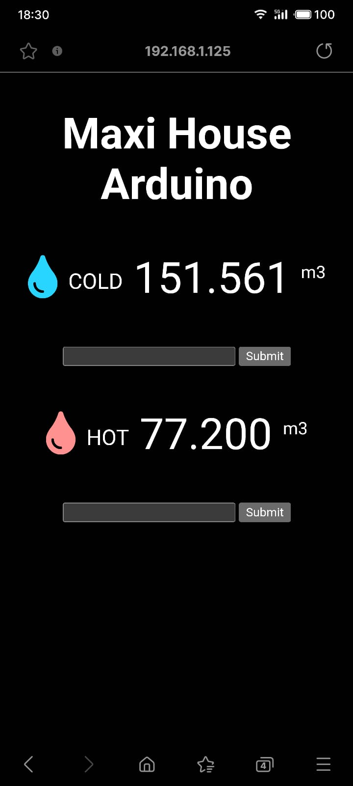
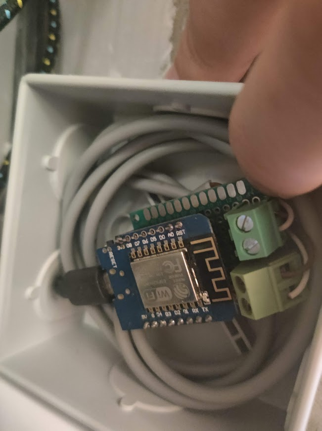

# WaterMeterWiFi
This is my app for Water Meter
i use two water meter with impulse output. 1 impulse = 1L of water.
And all informations you can see on local webserver or iot service https://open-monitoring.online 

Check this link! https://open-monitoring.online/public/scene/1559/

